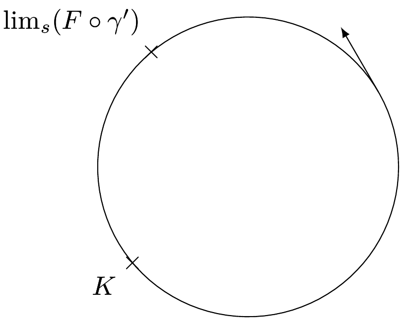

# phystricks : use python to create your pictures to be inserted in LaTeX

## General introduction

The purpose of this module is to produce pictures to be inserted in your LaTeX document using only python and [Sage](http://sagemath.org) techniques. The motto is :

«*if Sage can compute it, LaTeX can draw it*» 


### What problem do we solve ?

Including complex figures in LaTeX is always difficult because you 

* want use an external program because LaTeX as "programming language" is by far too complicated,
* want add labels that contains mathematical formulas; and these labels should be compiled by LaTeX, not by your external program,
* for some reasons, don't (want to) know ps stuff like psfrag.

### How do we solve ?

*phystricks* is a python (Sage in fact) module defining classes like point, segment, parametric curve, ... and many geometric relations between them. You describe your picture using Python and *phystricks* creates the `tikz` code to be included in your LaTeX file.

### Example

```python
# -*- coding: utf8 -*-

from phystricks import *
def VSJOooJXAwbVEt():
    pspict,fig = SinglePicture("VSJOooJXAwbVEt")
    pspict.dilatation(1)

    O=Point(0,0)

    circle=Circle( O,2 )           # center, radius

    # Points are parametrized by their angle (degree)
    A=circle.get_point(130)
    B=circle.get_point(220)
    tg=circle.get_tangent_vector(30)  

    # dist : the distance between the circle and the mark.
    # text : the LaTeX code that will be placed there.
    A.put_mark(dist=0.3,text="$\lim_{s}(F\circ\gamma')$",pspict=pspict)
    B.put_mark(dist=0.3,text="$K$",pspict=pspict)

    pspict.DrawGraphs(circle,A,tg,B)

    fig.no_figure()
    fig.conclude()
    fig.write_the_file()
```

The you compile the picture with Sage :

```
┌────────────────────────────────────────────────────────────────────┐
│ SageMath Version 7.0, Release Date: 2016-01-19                     │
│ Type "notebook()" for the browser-based notebook interface.        │
│ Type "help()" for help.                                            │
└────────────────────────────────────────────────────────────────────┘
sage: attach("<filename>.py")
sage: VSJOooJXAwbVEt()
```

Now the file `Fig_VSJOooJXAwbVEt.pstricks` is created and you just have to add the following lines in you LaTeX document :

```latex
\begin{center}
   \input{Fig_VSJOooJXAwbVEt.pstricks}
\end{center}
```
What you get is :



As you see, taking the tangent vector is a simple as calling the method `get_tangent_vector` with as argument the angle on the circle.

Notice that :

* The labels are well placed : they are in such a way that they will not intersect the circle.
* At no point the Sage code speaks about the size of the box containing the labels.

The trick is that *phystricks* does not only produces the `tikz` code for the picture, but also make LaTeX write the size of the box in an auxiliary file. Thus in a second pass of *phystricks*, the size of the box is known and the label can be correctly placed.

The LaTeX code inserted in your picture is compiled by LaTeX in the same time as your document.

### More informations


For more informations you can read the documentation. An look at the real live examples :

* [the documentation](http://laurent.claessens-donadello.eu/pdf/phystricks-doc.pdf)
* [the demonstrative document](http://laurent.claessens-donadello.eu/pdf/phystricks-demo.pdf)
* the pictures in [mazhe](http://laurent.claessens-donadello.eu/pdf/mazhe.pdf), download the sources at [github](https://github.com/LaurentClaessens/mazhe)
* the pictures in [smath](http://laurent.claessens-donadello.eu/pdf/smath.pdf), download the sources at [github](https://github.com/LaurentClaessens/smath)

